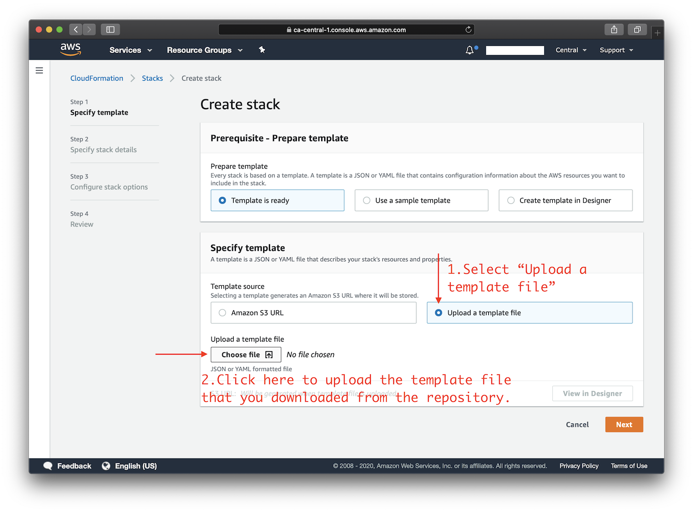
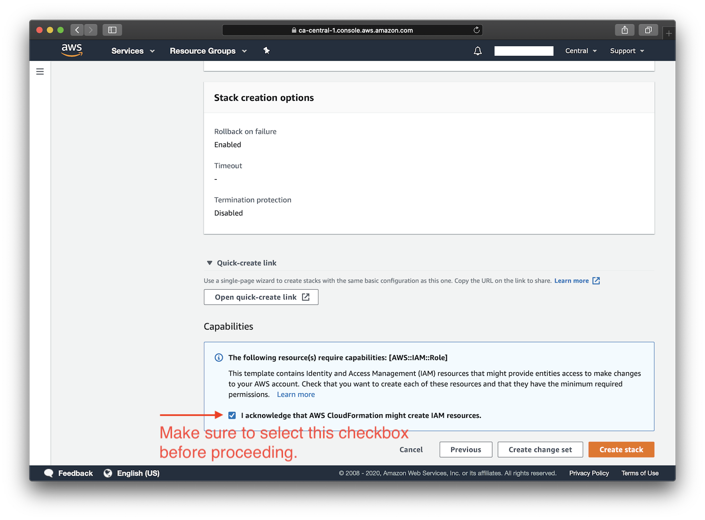

# Deploy to Amazon EC2 using CloudFormation

This template will create a fully-working Seafile instance on Amazon Elastic Compute Cloud (Amazon EC2). Please make sure to check the EC2 [pricing details](https://aws.amazon.com/ec2/pricing/on-demand/) before continuing. Using a `t2.micro` or `t3.micro` server instance for your deployment may qualify for the [AWS Free Tier](https://aws.amazon.com/free/).

Available customization parameters:

- Amazon EC2 instance type
> <details><summary><strong>Note</strong>: It is possible that not all instance type options offered by this template are available in a specific AWS region.(expand for details)
> </summary>
> 
> For example, you may not be able to deploy an `m5a.large` instance in `ap-east-1` (hypothetically). In that case, you might experience the following error during deployment: `The requested configuration is currently not supported. Please check the documentation for supported configurations`. Newly released regions are more prone to having this problem as there are less variety of instances. For more info about instance type availability, refer to [https://instances.vantage.sh/](https://instances.vantage.sh/).</details>
- Seafile Version (8.0, 9.0, 10.0 or 11.0)
- OS Type (currently only Ubuntu 20.04 is supported)
- Seafile Admin Password (accepted length: 8-30 characters)

> **Note:** DO NOT use these special characters within the password: `\ " '`

Make sure to deploy this template with an **AWS Account Root User** or an **IAM Account** with **Administrator Access**.

Right-click this [**template link**](https://raw.githubusercontent.com/haiwen/seafile-server-installer/master/aws/cloudformation-template-seafile.json) and save as a file on your computer. Then upload it as the template source in the [stack creation wizard](https://console.aws.amazon.com/cloudformation/home#/stacks/new). You may choose an AWS region using the selector to the right of your account information on the navigation bar. Continue creating the stack, and in the final step make sure to confirm that this template may create IAM resources.

After you click "create stack" in the final step, please wait for the stack creation and installation process to complete, which may take up to 15 minutes. As soon as the stack's status changes to **"CREATE_COMPLETE"**, you can use your browser to access the Seahub service. Click the **Outputs** tab to view your server login details. 

Click the icon below to start:

[](https://console.aws.amazon.com/cloudformation/home#/stacks/new)

## Screenshots

<details>
<summary>
Click here to view screenshots.
</summary>





</details>

## FAQs

<details>
<summary>
How to connect to the server via SSH after deployment?
</summary>

You need to know the username and the private key for your Amazon EC2 instance in order to login to it via SSH.

Each Linux server distribution on EC2 has its own default login username. Password login is disabled by default for new instances, and the use of private keys, or "key pairs", is enforced.

The default login username for Ubuntu distributions on EC2, is `ubuntu`.
> **Reference:** [https://docs.aws.amazon.com/AWSEC2/latest/UserGuide/connection-prereqs.html](https://docs.aws.amazon.com/AWSEC2/latest/UserGuide/connection-prereqs.html)

This template generates a key pair for you during deployment, and to acquire the private key you can choose one of the following two methods.

1. Copy the key pair ID displayed under the **Outputs** tab, and use the following command to retrieve the private key material and save it into a certificate file:

  > **Note:** You need to first properly set up the AWS CLI on your computer before using the following command. For more information on how to get started with AWS CLI, please refer to [Get started with the AWS CLI](https://docs.aws.amazon.com/cli/latest/userguide/cli-chap-getting-started.html).

  ```
  $ aws ssm get-parameter --region your-region --name /ec2/keypair/your-key-pair-id --with-decryption --query Parameter.Value --output text > new-key-file.pem
  ```

  

2. Copy the private key material directly from the **Outputs** tab, and save it into a certificate file. Note that You may need to format the private key by replacing all spaces with newlines, before saving to a file. The file will need to be set with [proper permissions](https://docs.aws.amazon.com/AWSEC2/latest/UserGuide/connection-prereqs.html#connection-prereqs-private-key) before using.

  

To apply proper permissions to your private key file, run the following command under the directory where the file is located:
```bash
$ sudo chmod 400 new-key-file.pem
```

Example command to login to your EC2 instance using SSH:
```bash
$ ssh -i path/to/your/new-key-file.pem instance-username@instance-ip-address
```
</details>

<details>
<summary>
How to delete the CloudFormation stack?
</summary>

You may use the "Delete" button on the CloudFormation stack page to delete the CloudFormation stack you created and its associated resources.
</details>

## Author

Copyright (C) 2023 [Scott X. L.](https://github.com/scottpedia) <[wtanglef@pm.me](mailto:wtanglef@pm.me)>

